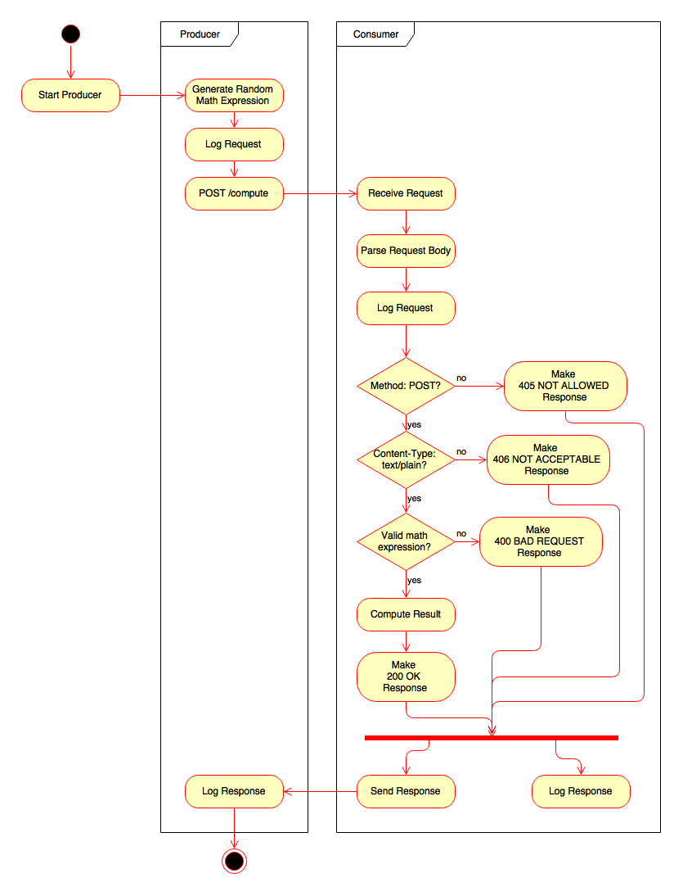
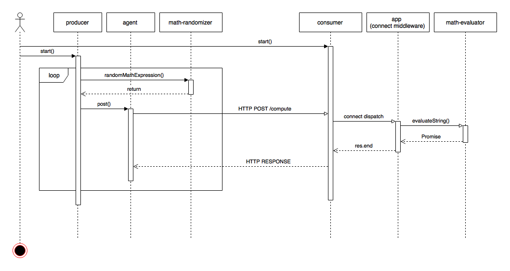

# InVision Code Challenge - Full-Stack

The assignment is to build a simple Producer/Consumer system. In this system the Generator will send a series of random arithmetic expressions, while the Evaluator will accept these expressions, compute the result and then report the solution to the Generator.

### Project Requirements

At a minimum, we would like to see the following implemented:

* The Producer and Consumer as separate NodeJS services.
* The Producer generating random addition expressions of two positive integers, e.g. "2+3="
* The Consumer computing and returning the correct mathematical result for each expression it receives
* The Consumer successfully processing requests from two Producers concurrently at a rate of at least 1 req/sec from each Producer (2 req/sec in aggregate)
* The Consumer and Producer should log all messages they generate and receive.

You are free to support more than simple addition, but it is not required.

The end product should:

* Be built in strict JavaScript and run with NodeJS
* NOT rely on any external services like Redis, ZeroMQ or similar technologies
* NOT use Express (Connect is Ok)
* Include UML Activity Diagram and UML Sequence Diagram documenting the business logic
* Include Unit tests

## Goals

* Support addition, subtraction, multiplication, and division
* Support positive, negative, and floating point numbers
* Follow basic HTTP REST API best practices
* Written in strict ES5 JavaScript
* Minimal code surface area
* Minimal external package dependencies (connect, body-parser, winston, and mkdirp)
* Simple and documented API
* 95%+ C0 (lines) test coverage
* 80%+ C1 (branches) test coverage

## Installation


### Requirements

* Node Engine: 0.12.7

### Install

```
$ git clone https://github.com/rscheuermann/invision.git .
$ npm install
```

## Running

### Start The Consumer

The Consumer can be started with the following command:

```
$ npm start
---------------------------------
CONSUMER STARTED
 - Port: 3000
---------------------------------
```

### Start A Producer

A Producer can be started with the following command:

```
$ npm run producer
---------------------------------
PRODUCER STARTED
 - URL: http://localhost:3000/compute
 - Reqs/sec: 10
---------------------------------
```

Many concurrent Producers can be started by issuing additional `npm run producer` commands. 


#### Changing Requests Per Second

You can increase the number of requests/sec a Producer makes to the Consumer by setting an environment variable, like so:

```
$ REQS_PER_SECOND=50 npm run producer
---------------------------------
PRODUCER STARTED
 - URL: http://localhost:3000/compute
 - Reqs/sec: 50
---------------------------------
```

### Viewing Logs

The consumer logs requests and responses to the `logs/consumer.log` file:

```
$ tail -f logs/consumer.log
2015-08-09T11:57:22.383Z - info: REQUEST  "POST /compute HTTP/1.1" -     - [7.38 * 5.05 = ]
2015-08-09T11:57:22.384Z - info: RESPONSE "POST /compute HTTP/1.1" - 200 - [7.38 * 5.05 = 37.269]
```

The producers log requests and response to the `logs/producer.log` file:

```
$ tail -f logs/producers.log
2015-08-09T11:57:22.382Z - info: REQUEST  "POST http://localhost:3000/compute" -     - [7.38 * 5.05 = ]
2015-08-09T11:57:22.384Z - info: RESPONSE "POST http://localhost:3000/compute" - 200 - [7.38 * 5.05 = 37.269] 3ms
```

## Unit Tests

### Running Tests

```
$ npm test
    
    48 passing (2s)
```

### Running Code Coverage Report

```
$ npm run coverage
=============================== Coverage summary ===============================
Statements   : 96.91% ( 157/162 )
Branches     : 89.74% ( 35/39 )
Functions    : 90% ( 27/30 )
Lines        : 96.91% ( 157/162 )
================================================================================
```

## UML Activity Diagram



## UML Sequence Diagram

